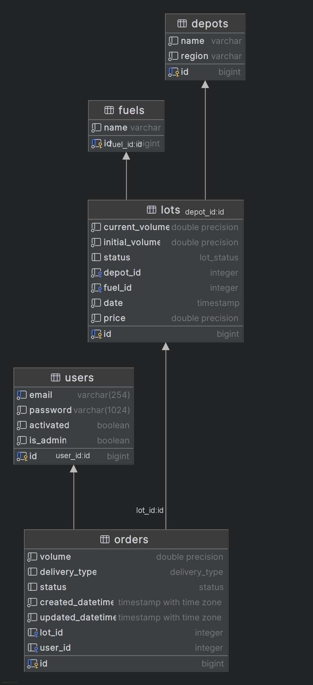

# Луковка - сервис по покупке топлива

## Содержания

- [Луковка - сервис по покупке топлива](#луковка---сервис-по-покупке-топлива)
  - [Содержания](#содержания)
  - [Описание проекта](#описание-проекта)
  - [Стек технологий](#стек-технологий)
  - [Функционал](#функционал)
  - [Схема базы данных](#схема-базы-данных)
  - [Демонстрация](#демонстрация)

## Описание проекта

Сервис по покупке топлива c нефтяных баз. Пользователи могут просматривать
каталог лотов, оформлять заказы. Администраторы могут добавлять новые Лоты,
Нефтяные базы, Типы топлива, а также управлять заказами

## Стек технологий

- Frontend:
  - React
  - Typescript
  - MobX
  - Bootstrap
- Backend:
  - Python
  - FastAPI
  - Postgres
  - Docker

## Функционал

- Регистрация и авторизация пользователей (через JWT)
- Маршруты API по созданию новых Нефтяных баз и Типов топлива (Только админам)
- Админка, через которую грузится csv файл c лотами ([пример csv](for_readme/lots_example.csv))
- Общедоступный каталог лотов (с бесконечным скроллом) с функциями поиска и фильтрации
- Страница лота с подробной информацией и возможностью оформить заказ
- Страница оформления заказа (пользователь может выбрать количество и способ доставки)
- Страница со всеми заказами пользователя (админ может видеть все заказы, а также менять их состояние (API))
- Отправка писем на почту при регистрации, оформлении заказа и изменении статуса заказа
- Страница профиля

## Схема базы данных

## Демонстрация 

Сайт https://where-pizza.ru/
Логин: admin
Пароль: admin
